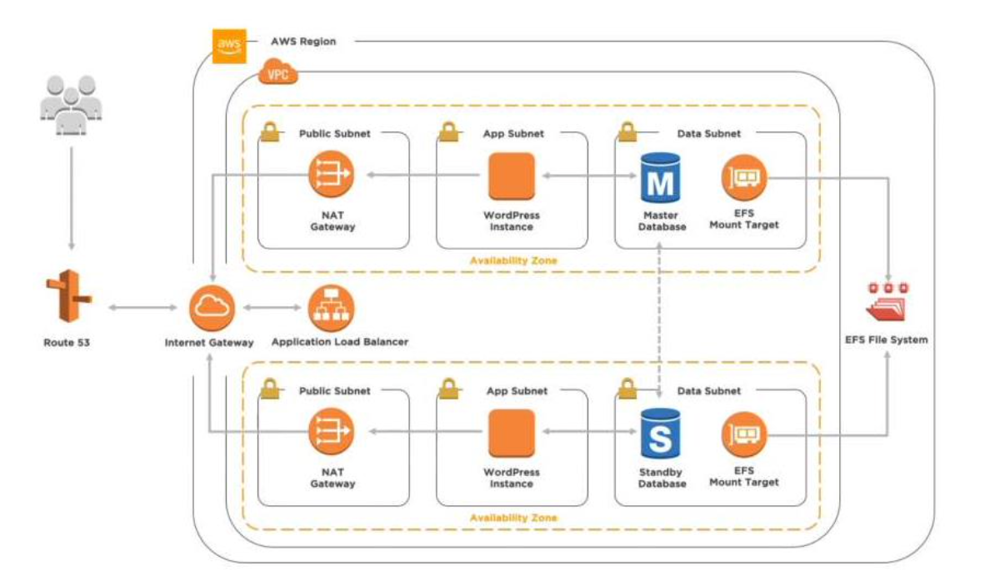

# equifax-sre-challenge

Version desarrollada para desafio en AWS

## Descripción

Este proyecto se basa en la creación de una infraestructura en AWS para la implementación de una aplicación web. La
infraestructura se compone de los siguientes elementos:

- **VPC**: Virtual Private Cloud que contiene todos los recursos de la infraestructura.
- **Subnets**: Subredes públicas y privadas para la implementación de los recursos.
- **Internet Gateway**: Permite la conexión de la VPC con internet.
- **Route Tables**: Tablas de ruteo para el tráfico de red.
- **Security Groups**: Grupos de seguridad para controlar el tráfico de red.
- **EC2**: Instancias de EC2 para la implementación de la aplicación web.
- **Elastic Load Balancer**: Balanceador de carga para distribuir el tráfico entre las instancias de EC2.
- **Auto Scaling Group**: Grupo de auto escalado para la administración de las instancias de EC2.
- **Launch Configuration**: Configuración de lanzamiento para las instancias de EC2.
- **RDS**: Base de datos relacional para la persistencia de datos.
- **EFS**: Sistema de archivos elástico para el almacenamiento de archivos.

Además, se ha utilizado una imagen creada con ansible y packer para la creación de las instancias de EC2.

## Contenido del Repositorio

- **Variables**: Archivo de variables para la configuración de la infraestructura.
- **provision**: Archivos de configuración de la AMI (ansible y packer).
- **infra**: Archivos de configuración de la infraestructura en Terraform.


## Arquitectura

La arquitectura de la infraestructura se muestra en la siguiente imagen:



## Requerimientos

- Crear una cuenta en Terraform Cloud (para el backend storage)
- Crear un usuario en AWS con permisos de administrador
- Configurar las credenciales de AWS en el archivo `~/.aws/credentials` o crear un archivo `.envrc` con las siguientes variables:

```bash
export AWS_ACCESS_KEY_ID=""
export AWS_SECRET_ACCESS_KEY=""
export AWS_REGION=""
export TF_TOKEN_app_terraform_io=""

```

## Implementación


Para la implementación de la infraestructura se deben seguir los siguientes pasos:

1. Clonar el repositorio:

```bash

git clone https://github.com/caherrera/equifax-sre-challenge-aws.git

```

2. Crear la imagen con Packer:

```bash
cd provision
make all
```

3. Crear la infraestructura con Terraform:

```bash
cd infra
make all
```


